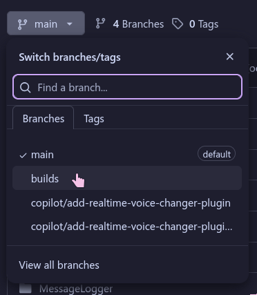

# Aliucord guide for beginners

## How to install Aliucord

- [Aliucord Manager installation guide](https://github.com/Aliucord/Manager#installation)
- [Direct Manager APK link](https://github.com/Aliucord/Manager/releases/download/v1.1.1/aliucord-manager-v1.1.1.apk)

## How to install plugins

1. Join the [Aliucord Discord server](https://discord.gg/EsNDvBaHVU)
2. Make sure you are using the Aliucord app
3. Go to [#plugins-list](https://discord.com/channels/811255666990907402/811275162715553823) or [#new-plugins](https://discord.com/channels/811255666990907402/845784407846813696) channels and hold any message (NOT THE LINK)
4. Click on the first option ("Open Plugin Downloader")
5. Click on any of the plugins shown in the Plugin Downloader to install them

:::tip Tips

- Most plugins need an app restart to work properly.
- The PluginWeb plugin is recommended if you want a built-in plugin list.
  :::

## How to install themes

1. Join the [Aliucord Discord server](https://discord.gg/EsNDvBaHVU)
2. Make sure you are using the Aliucord app
3. Install the [Themer plugin](https://raw.githubusercontent.com/Vendicated/AliucordPlugins/builds/Themer.zip)
4. Go to [#themes](https://discord.com/channels/811255666990907402/824357609778708580) channel and hold any message (NOT THE LINK)
5. Click on the first option ("Install [theme name]")

:::tip Tips

- After installing a theme you should go to Themer settings to enable it.
- Themes require an app restart to work properly.
- [Additional info about Themer plugin](/themer/)
  :::

## How to install plugins manually

Required for [#unmaintained-plugins](https://discord.com/channels/811255666990907402/861935147272110100) channel
:::tip
If you already have the plugin .zip, just follow two last steps.
:::

1. Go to any plugin repository ([like this one](https://github.com/Juby210/Aliucord-plugins))
2. Click the branch button and select `builds`  

3. Click the `[PluginName].zip` of the plugin you want
4. Click `Raw`, `View raw` or the download button to download the .zip file
5. Using a file manager ([we recommend Material Files](https://play.google.com/store/apps/details?id=me.zhanghai.android.files) ([F-Droid](https://f-droid.org/packages/me.zhanghai.android.files/))) move the downloaded `.zip` to the `Aliucord/plugins` folder
6. Restart Aliucord
